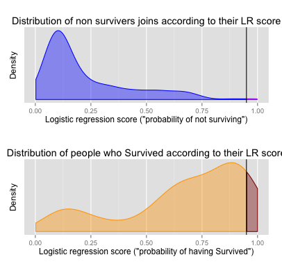

## Titanic Dataset

```{r, echo=FALSE}
dataset <- read.csv("~/Desktop/r_language/data_products_project/train_titanic.csv")
head(dataset)
```

--- .class #id 

## Logistic Regression on titanic data set

```{r,echo=FALSE}
sv <- table(dataset$Survived)
```
 - `r sv[1]` deaths
 - `r sv[2]` survivors
 - Logistic regression model to predict the odds of survival.
 - Visualize the distribution of survivors and see the effect of choosing different thresholds on the distribution density.


--- .class #id 

## Now you can see how the threshold changes the distribution of survivors.


 - Interactive slider to change the threshold.
 - Plot to visualize the ROC curve and the position of the threshold.
 - Plot to visualize the distribution of the survivors and non survivors.
 - Different colors to distinguish the false and true positives in each group.

--- .class #id 

## ... and it can generate cool plots


```{r} 

```


--- .class #id 

## Are you interested?

- visit us on shinyapps.io [(https://karolu.shinyapps.io/data_products_project/)](https://karolu.shinyapps.io/data_products_project/)
- fork on GitHub ([https://github.com/karolur/data_products_project](https://github.com/karolur/data_products_project))
-  enroll on [Coursera Data Science Specialization](https://www.coursera.org/specialization/jhudatascience/1) and learn how to build your own


