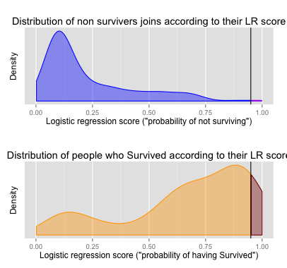

## Titanic Dataset


```
##   PassengerId Survived Pclass
## 1           1        0      3
## 2           2        1      1
## 3           3        1      3
## 4           4        1      1
## 5           5        0      3
## 6           6        0      3
##                                                  Name    Sex Age SibSp
## 1                             Braund, Mr. Owen Harris   male  22     1
## 2 Cumings, Mrs. John Bradley (Florence Briggs Thayer) female  38     1
## 3                              Heikkinen, Miss. Laina female  26     0
## 4        Futrelle, Mrs. Jacques Heath (Lily May Peel) female  35     1
## 5                            Allen, Mr. William Henry   male  35     0
## 6                                    Moran, Mr. James   male  NA     0
##   Parch           Ticket    Fare Cabin Embarked
## 1     0        A/5 21171  7.2500              S
## 2     0         PC 17599 71.2833   C85        C
## 3     0 STON/O2. 3101282  7.9250              S
## 4     0           113803 53.1000  C123        S
## 5     0           373450  8.0500              S
## 6     0           330877  8.4583              Q
```

--- .class #id 

## Logistic Regression on titanic data set


 - 549 deaths
 - 342 survivors
 - Logistic regression model to predict the odds of survival.
 - Visualize the distribution of survivors and see the effect of choosing different thresholds on the distribution density.


--- .class #id 

## Now you can see how the threshold changes the distribution of survivors.


 - Interactive slider to change the threshold.
 - Plot to visualize the ROC curve and the position of the threshold.
 - Plot to visualize the distribution of the survivors and non survivors.
 - Different colors to distinguish the false and true positives in each group.

--- .class #id 

## ... and it can generate cool plots




--- .class #id 

## Are you interested?

- visit us on shinyapps.io [(https://karolu.shinyapps.io/data_products_project/)](https://karolu.shinyapps.io/data_products_project/)
- fork on GitHub ([https://github.com/karolur/data_products_project](https://github.com/karolur/data_products_project))
-  enroll on [Coursera Data Science Specialization](https://www.coursera.org/specialization/jhudatascience/1) and learn how to build your own


